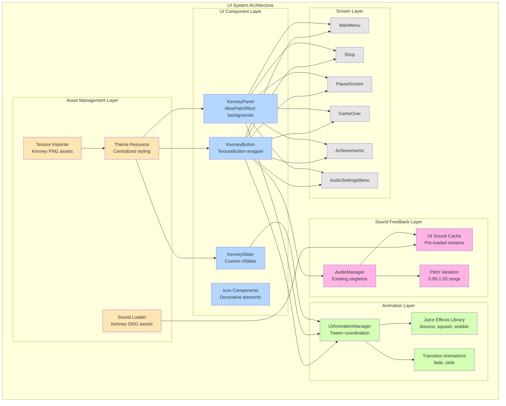
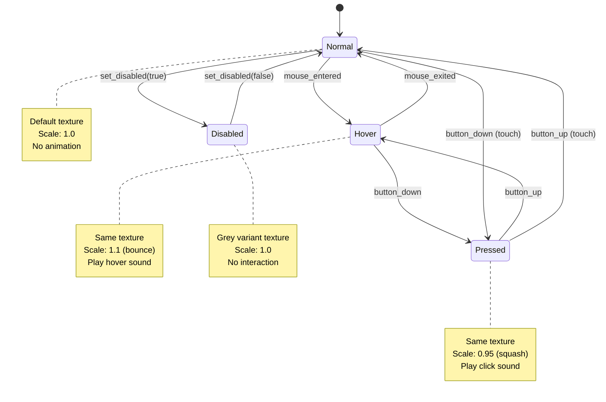

# Design Document: UI Overhaul with Kenney Pack

## Overview

This design document specifies the technical implementation for overhauling the HopNSplat mobile game UI using Kenney UI pack assets. The overhaul transforms the current basic blue StyleBoxFlat buttons into a playful, engaging, and professional UI system that matches the game's pink alien theme and casual/cartoon aesthetic.

### Goals

- Replace all StyleBoxFlat-based UI elements with TextureButton nodes using Kenney asset textures
- Implement a comprehensive animation system for UI juice effects (bounce, squash, wobble)
- Integrate UI sound feedback through the existing AudioManager
- Create a centralized Theme resource for consistent styling across all screens
- Optimize for mobile performance (60 FPS target on 540x960 viewport)
- Maintain accessibility standards (44x44px minimum touch targets)

### Scope

The overhaul applies to six main UI screens:
1. MainMenu.tscn - Entry point with navigation buttons
2. Shop.tscn - Item browsing and purchasing interface
3. PauseScreen.tscn - In-game pause overlay
4. GameOver.tscn - End-game statistics and retry options
5. Achievements.tscn - Achievement progress display
6. AudioSettingsMenu.tscn - Audio control sliders and toggles

### Non-Goals

- Modifying gameplay mechanics or in-game HUD elements
- Creating new UI screens beyond the six specified
- Implementing new audio assets (using existing Kenney sounds only)
- Changing the game's core color palette or theme

## Architecture

### System Components



### Design Patterns

**Component-Based UI Architecture**
- Each UI element (button, panel, slider) is a self-contained scene or script
- Reusable components reduce duplication across the six screens
- Components expose configuration properties for customization

**State Machine for Button States**



**Observer Pattern for Audio Settings**
- AudioManager emits signals when volume changes
- UI sliders subscribe to these signals for synchronization
- Ensures consistency between settings UI and actual audio state


### Technology Stack

- **Engine**: Godot 4.6
- **Rendering**: Mobile renderer (GLES3/Vulkan Mobile)
- **UI Nodes**: TextureButton, TextureRect, Panel, NinePatchRect
- **Animation**: Tween nodes (preferred over AnimationPlayer for performance)
- **Audio**: AudioStreamPlayer via AudioManager autoload
- **Asset Format**: PNG textures (Kenney pack), OGG sounds

### Color Palette Selection

Based on the pink alien theme, the design will primarily use:
- **Primary**: Yellow pack (warm, inviting, matches pink alien)
- **Secondary**: Red pack (for important actions, warnings)
- **Accent**: Extra pack icons and decorative elements

Rationale: Yellow provides warm contrast to the pink alien character while maintaining a playful, casual aesthetic. Red is reserved for critical actions (quit, delete) and special highlights (new high score).

## Components and Interfaces

### 1. KenneyButton Component

A reusable button component that wraps TextureButton with animation and sound.

**Node Structure:**
```
KenneyButton (TextureButton)
├── Icon (TextureRect) [optional]
├── Label (Label) [optional]
└── AnimationTween (Tween)
```

**Script Interface:**
```gdscript
class_name KenneyButton
extends TextureButton

# Configuration
@export var button_style: ButtonStyle = ButtonStyle.RECTANGLE_DEPTH_GLOSS
@export var color_pack: ColorPack = ColorPack.YELLOW
@export var icon_texture: Texture2D
@export var button_text: String = ""
@export var enable_idle_wobble: bool = false

# Animation settings
@export var hover_scale: float = 1.1
@export var press_scale: float = 0.95
@export var animation_duration: float = 0.15

# Sound settings
@export var hover_sound: AudioStream
@export var click_sound: AudioStream

enum ButtonStyle {
    RECTANGLE_FLAT,
    RECTANGLE_GLOSS,
    RECTANGLE_DEPTH_GLOSS,
    ROUND_FLAT,
    ROUND_DEPTH_GLOSS,
    SQUARE_FLAT,
    SQUARE_DEPTH_GLOSS
}

enum ColorPack {
    YELLOW,
    RED,
    BLUE,
    GREEN,
    GREY
}

# Public methods
func set_button_text(text: String) -> void
func set_icon(texture: Texture2D) -> void
func play_hover_animation() -> void
func play_press_animation() -> void
func play_idle_wobble() -> void
```

**Texture State Mapping:**
- Normal: `button_rectangle_depth_gloss.png`
- Hover: Same texture with scale animation
- Pressed: Same texture with scale animation
- Disabled: Grey pack variant or modulate to greyscale

### 2. KenneyPanel Component

A reusable panel background using NinePatchRect for scalable backgrounds.

**Node Structure:**
```
KenneyPanel (NinePatchRect)
└── Content (Container) [optional]
```

**Script Interface:**
```gdscript
class_name KenneyPanel
extends NinePatchRect

@export var panel_style: PanelStyle = PanelStyle.RECTANGLE_DEPTH
@export var color_pack: ColorPack = ColorPack.YELLOW
@export var semi_transparent: bool = false

enum PanelStyle {
    RECTANGLE,
    RECTANGLE_DEPTH,
    SQUARE,
    SQUARE_DEPTH
}

# Public methods
func set_transparency(alpha: float) -> void
func play_entrance_animation() -> void
```

### 3. KenneySlider Component

A custom slider for audio settings using Kenney slider textures.

**Node Structure:**
```
KenneySlider (HSlider)
├── Background (TextureRect)
├── Fill (TextureRect)
└── Handle (TextureRect)
```

**Script Interface:**
```gdscript
class_name KenneySlider
extends HSlider

@export var slider_color: ColorPack = ColorPack.YELLOW
@export var show_value_label: bool = true
@export var value_suffix: String = "%"

# Public methods
func set_slider_value(value: float) -> void
func play_handle_animation() -> void
```

### 4. UIAnimationManager (Singleton)

A global manager for coordinating UI animations and preventing performance issues.

**Script Interface:**
```gdscript
extends Node

# Animation tracking
var active_tweens: Array[Tween] = []
const MAX_CONCURRENT_TWEENS: int = 10

# Juice effect presets
func bounce_in(node: Node, duration: float = 0.15) -> Tween
func squash(node: Node, duration: float = 0.1) -> Tween
func pop_out(node: Node, duration: float = 0.2) -> Tween
func wobble(node: Node, loop: bool = true) -> Tween
func slide_in(node: Node, direction: Vector2, duration: float = 0.3) -> Tween
func fade_in(node: Node, duration: float = 0.2) -> Tween
func count_up(label: Label, from: int, to: int, duration: float = 0.5) -> Tween

# Tween management
func register_tween(tween: Tween) -> void
func cleanup_finished_tweens() -> void
func stop_all_tweens() -> void
```

### 5. UISoundManager (Extends AudioManager)

Extends the existing AudioManager with UI-specific sound functionality.

**Script Interface:**
```gdscript
# Added to AudioManager
var ui_sounds_cache: Dictionary = {}
var ui_sound_pitch_variance: float = 0.05

func play_ui_hover() -> void
func play_ui_click() -> void
func play_ui_switch() -> void
func play_ui_purchase() -> void
func play_ui_achievement_unlock() -> void

# Internal
func _play_ui_sound(sound: AudioStream, pitch_variance: bool = true) -> void
func _get_random_pitch() -> float
```

## Data Models

### Theme Resource Structure

**File**: `res://resources/themes/kenney_ui_theme.tres`

```gdscript
[gd_resource type="Theme" format=3]

# Button styles
[sub_resource type="StyleBoxTexture" id="button_normal"]
texture = preload("res://assets/ui_packs/Yellow/Default/button_rectangle_depth_gloss.png")
region_rect = Rect2(0, 0, 190, 49)
margin_left = 10
margin_right = 10
margin_top = 10
margin_bottom = 10

[sub_resource type="StyleBoxTexture" id="button_hover"]
# Same texture, animation handles visual change

[sub_resource type="StyleBoxTexture" id="button_pressed"]
# Same texture, animation handles visual change

# Panel styles
[sub_resource type="StyleBoxTexture" id="panel_background"]
texture = preload("res://assets/ui_packs/Extra/Default/input_rectangle.png")
# ... nine-patch margins

# Slider styles
[sub_resource type="StyleBoxTexture" id="slider_background"]
texture = preload("res://assets/ui_packs/Yellow/Default/slide_horizontal_grey.png")

[sub_resource type="StyleBoxTexture" id="slider_fill"]
texture = preload("res://assets/ui_packs/Yellow/Default/slide_horizontal_color.png")

# Font configurations
[resource]
Button/fonts/font = preload("res://assets/fonts/arial.ttf")
Button/font_sizes/font_size = 20
Button/colors/font_color = Color(1, 1, 1, 1)
Button/colors/font_hover_color = Color(1, 1, 1, 1)
Button/colors/font_pressed_color = Color(0.9, 0.9, 0.9, 1)

Label/fonts/font = preload("res://assets/fonts/arial.ttf")
Label/font_sizes/font_size = 18
Label/colors/font_color = Color(1, 1, 1, 1)
```

### Asset Organization Structure

```
assets/
├── ui_packs/
│   ├── Yellow/
│   │   └── Default/
│   │       ├── button_rectangle_*.png (10 variants)
│   │       ├── button_round_*.png (10 variants)
│   │       ├── button_square_*.png (10 variants)
│   │       ├── check_*.png (checkbox variants)
│   │       ├── slide_*.png (slider variants)
│   │       ├── star*.png (rating icons)
│   │       └── icon_*.png (UI icons)
│   ├── Red/ (same structure)
│   ├── Extra/
│   │   └── Default/
│   │       ├── divider*.png
│   │       ├── icon_arrow_*.png
│   │       ├── icon_play_*.png
│   │       ├── icon_repeat_*.png
│   │       └── input_*.png (panel backgrounds)
│   └── [Blue, Green, Grey]/ (available but not primary)
├── ui_sounds/
│   ├── click-a.ogg
│   ├── click-b.ogg
│   ├── tap-a.ogg
│   ├── tap-b.ogg
│   ├── switch-a.ogg
│   └── switch-b.ogg
└── fonts/
    └── arial.ttf
```

### Import Settings for Kenney Assets

All Kenney PNG textures should use these import settings:

```
[remap]
importer="texture"
type="CompressedTexture2D"

[params]
compress/mode=2  # VRAM Compressed
compress/high_quality=false
compress/lossy_quality=0.7
compress/hdr_compression=1
compress/normal_map=0
compress/channel_pack=0
mipmaps/generate=false  # Disabled for crisp UI
mipmaps/limit=-1
roughness/mode=0
roughness/src_normal=""
process/fix_alpha_border=true
process/premult_alpha=false
process/normal_map_invert_y=false
process/hdr_as_srgb=false
process/hdr_clamp_exposure=false
process/size_limit=0
detect_3d/compress_to=0
```


## Screen-Specific Designs

### 1. MainMenu Screen Design

**Current State Analysis:**
- Uses StyleBoxFlat buttons with blue color scheme
- Basic VBoxContainer layout with centered buttons
- Emoji icons in button text
- No animations or sound feedback

**Redesign Specification:**

**Visual Hierarchy:**
```
MainMenu (Control)
├── Background (ColorRect) - Keep existing gradient
├── BackgroundDecoration (Control)
│   ├── FloatingStar1 (TextureRect) - star.png with float animation
│   ├── FloatingStar2 (TextureRect)
│   └── DecorativeArrow (TextureRect) - arrow_decorative_s.png
├── VBoxContainer
│   ├── TitleLabel - Enhanced with shadow
│   ├── Spacer1
│   ├── StatsPanel (KenneyPanel)
│   │   ├── HighScoreLabel - With star icon
│   │   └── CurrencyLabel - With coin icon
│   ├── Spacer2
│   ├── ButtonContainer (VBoxContainer)
│   │   ├── PlayButton (KenneyButton) - RECTANGLE_DEPTH_GLOSS, Yellow, idle wobble
│   │   ├── ShopButton (KenneyButton) - RECTANGLE_GLOSS, Yellow
│   │   ├── AchievementsButton (KenneyButton) - RECTANGLE_GLOSS, Yellow
│   │   ├── SettingsButton (KenneyButton) - RECTANGLE_GLOSS, Yellow
│   │   └── QuitButton (KenneyButton) - RECTANGLE_GLOSS, Red
└── AudioPlayers (hover/click sounds)
```

**Button Specifications:**
- PlayButton: 300x70px, Yellow depth gloss, rocket icon, idle wobble enabled
- ShopButton: 300x60px, Yellow gloss, cart icon
- AchievementsButton: 300x60px, Yellow gloss, star icon
- SettingsButton: 300x60px, Yellow gloss, gear icon
- QuitButton: 300x60px, Red gloss, cross icon

**Animation Sequence:**

```mermaid
gantt
    title MainMenu Animation Timeline
    dateFormat X
    axisFormat %Ls
    
    section Background
    Fade in background    :0, 300ms
    
    section Title
    Title drop with bounce :100ms, 400ms
    
    section Stats
    Stats panel slide in   :300ms, 300ms
    
    section Buttons
    PlayButton appear      :600ms, 200ms
    ShopButton appear      :700ms, 200ms
    AchievementsButton     :800ms, 200ms
    SettingsButton appear  :900ms, 200ms
    QuitButton appear      :1000ms, 200ms
    
    section Idle
    PlayButton wobble loop :1200ms, 2000ms
```

**Implementation Notes:**
- Replace Button nodes with KenneyButton instances
- Add TextureRect nodes for decorative stars with floating animation
- Implement stagger animation in _ready() using UIAnimationManager
- Connect button signals to play hover/click sounds

### 2. Shop Screen Design

**Current State Analysis:**
- TabContainer with three tabs (Player Skins, Boost Upgrades, Power-ups)
- GridContainer for item display
- Basic button styling
- Currency display in header

**Redesign Specification:**

**Visual Hierarchy:**
```
Shop (Control)
├── Background (ColorRect) - Keep existing
├── VBoxContainer
│   ├── HeaderPanel (KenneyPanel)
│   │   ├── BackButton (KenneyButton) - SQUARE_DEPTH_GLOSS, arrow icon
│   │   ├── TitleLabel - "SHOP" with cart icon
│   │   └── CurrencyPanel (KenneyPanel)
│   │       └── CurrencyLabel - With coin icon
│   ├── TabContainer - Custom styled
│   │   ├── PlayerSkinsTab (ScrollContainer)
│   │   │   └── SkinsGrid (GridContainer)
│   │   │       └── [ShopItemCard] x N
│   │   ├── BoostUpgradesTab (ScrollContainer)
│   │   │   └── UpgradesGrid (GridContainer)
│   │   │       └── [ShopItemCard] x N
│   │   └── PowerupsTab (ScrollContainer)
│   │       └── PowerupsGrid (GridContainer)
│   │           └── [ShopItemCard] x N
```

**ShopItemCard Component:**
```
ShopItemCard (KenneyPanel)
├── ItemIcon (TextureRect)
├── ItemName (Label)
├── ItemDescription (Label)
├── PricePanel (KenneyPanel)
│   ├── CoinIcon (TextureRect)
│   └── PriceLabel (Label)
├── PurchaseButton (KenneyButton) - RECTANGLE_DEPTH_GLOSS
└── EquippedCheckmark (TextureRect) - icon_checkmark.png [hidden by default]
```

**Tab Styling:**
- Use Yellow button textures for tab backgrounds
- Active tab: button_rectangle_depth_gloss.png
- Inactive tab: button_rectangle_flat.png with 80% opacity
- Tab switch animation: Slide content in from right (0.3s)

**Purchase Animation Sequence:**
1. Button press animation (0.1s)
2. Coin icon flies from item to currency display (0.5s with arc motion)
3. Currency count-up animation (0.3s)
4. Checkmark appears with pop-out animation (0.2s)
5. Particle burst at item location (star textures)

**Implementation Notes:**
- Create ShopItemCard as reusable scene
- Implement tab switching with slide animation in shop.gd
- Add particle system using CPUParticles2D with star.png texture
- Cache item card instances for performance

### 3. PauseScreen Design

**Current State Analysis:**
- Semi-transparent overlay
- Centered panel with buttons
- Basic score display
- No visual polish

**Redesign Specification:**

**Visual Hierarchy:**
```
PauseScreen (Control)
├── Background (ColorRect) - Semi-transparent black (0.7 alpha)
├── PausePanel (KenneyPanel) - RECTANGLE_DEPTH, semi-transparent
│   ├── VBoxContainer
│   │   ├── TitleLabel - "PAUSED" with larger font
│   │   ├── Divider (TextureRect) - divider_edges.png
│   │   ├── StatsContainer (VBoxContainer)
│   │   │   ├── ScorePanel (KenneyPanel)
│   │   │   │   └── ScoreLabel - With star icon
│   │   │   └── CoinsPanel (KenneyPanel)
│   │   │       └── CoinsLabel - With coin icon
│   │   ├── Divider2 (TextureRect)
│   │   └── ButtonContainer (VBoxContainer)
│   │       ├── ResumeButton (KenneyButton) - RECTANGLE_DEPTH_GLOSS, Yellow, play icon
│   │       ├── SettingsButton (KenneyButton) - RECTANGLE_GLOSS, Yellow, gear icon
│   │       ├── RestartButton (KenneyButton) - RECTANGLE_GLOSS, Yellow, repeat icon
│   │       └── MenuButton (KenneyButton) - RECTANGLE_GLOSS, Red, home icon
```

**Panel Specifications:**
- PausePanel: 400x500px, Yellow depth with 85% opacity
- Stat panels: 350x50px, Yellow flat with 70% opacity
- Buttons: 350x60px

**Animation Sequence:**
1. Background fades in (0.2s)
2. Panel zooms in with elastic easing (0.4s)
3. Content elements fade in sequentially (0.15s each, 0.05s delay)

**Implementation Notes:**
- Use modulate property for panel transparency
- Implement zoom animation with scale from 0.5 to 1.0
- Add blur effect to background if performance allows (ShaderMaterial)
- Ensure buttons remain functional during animation

### 4. GameOver Screen Design

**Current State Analysis:**
- Dark overlay
- Centered statistics display
- Three action buttons
- Continue button highlighted with green modulate

**Redesign Specification:**

**Visual Hierarchy:**
```
GameOver (Control)
├── Background (ColorRect) - Dark overlay (0.8 alpha)
├── GameOverPanel (KenneyPanel) - RECTANGLE_DEPTH
│   ├── VBoxContainer
│   │   ├── TitleLabel - "GAME OVER" or "NEW HIGH SCORE!"
│   │   ├── StarRating (HBoxContainer)
│   │   │   ├── Star1 (TextureRect) - star.png or star_outline.png
│   │   │   ├── Star2 (TextureRect)
│   │   │   └── Star3 (TextureRect)
│   │   ├── StatsContainer (VBoxContainer)
│   │   │   ├── FinalScorePanel (KenneyPanel)
│   │   │   │   └── FinalScoreLabel
│   │   │   ├── CurrencyPanel (KenneyPanel)
│   │   │   │   └── CurrencyEarnedLabel
│   │   │   ├── JumpsPanel (KenneyPanel)
│   │   │   │   └── JumpsLabel
│   │   │   └── HighScorePanel (KenneyPanel)
│   │   │       └── HighScoreLabel
│   │   └── ButtonContainer (VBoxContainer)
│   │       ├── ContinueButton (KenneyButton) - RECTANGLE_DEPTH_GLOSS, Yellow, wobble, TV icon
│   │       ├── RestartButton (KenneyButton) - RECTANGLE_DEPTH_GLOSS, Yellow, repeat icon
│   │       └── MenuButton (KenneyButton) - RECTANGLE_GLOSS, Yellow, home icon
└── CelebrationParticles (CPUParticles2D) - For new high score
```

**Star Rating Logic:**
- 1 star: Score > 0
- 2 stars: Score > 50
- 3 stars: Score > 100
- Animate stars filling in sequence with pop effect

**New High Score Animation:**
1. Title flashes between colors (0.5s loop, 3 times)
2. Particle burst from title (star textures)
3. All stat panels bounce in sequence
4. Celebration sound effect

**Continue Button Emphasis:**
- Larger size: 350x80px (vs 350x60px for others)
- Idle wobble animation enabled
- Glow effect using duplicate TextureRect with modulate and scale

**Implementation Notes:**
- Detect new high score in game_over.gd _ready()
- Implement star rating animation with sequential delays
- Add CPUParticles2D with star.png texture for celebration
- Continue button wobble should be more pronounced (1.05 scale vs 1.02)

### 5. Achievements Screen Design

**Current State Analysis:**
- Simple list of achievements
- Basic progress display
- No visual distinction between locked/unlocked

**Redesign Specification:**

**Visual Hierarchy:**
```
Achievements (Control)
├── Background (ColorRect) - Dark blue gradient
├── VBoxContainer
│   ├── HeaderPanel (KenneyPanel)
│   │   ├── BackButton (KenneyButton) - SQUARE_DEPTH_GLOSS, arrow icon
│   │   ├── TitleLabel - "ACHIEVEMENTS"
│   │   └── ProgressPanel (KenneyPanel)
│   │       └── ProgressLabel - "X/15" with star icon
│   ├── Divider (TextureRect)
│   └── ScrollContainer
│       └── AchievementsList (VBoxContainer)
│           └── [AchievementCard] x 15
```

**AchievementCard Component:**
```
AchievementCard (KenneyPanel)
├── HBoxContainer
│   ├── IconContainer (CenterContainer)
│   │   ├── IconBackground (TextureRect) - button_square_depth_gloss.png
│   │   └── AchievementIcon (TextureRect) - Custom per achievement
│   ├── InfoContainer (VBoxContainer)
│   │   ├── TitleLabel
│   │   ├── DescriptionLabel
│   │   └── ProgressBar (KenneySlider) - For progressive achievements
│   └── StatusContainer (CenterContainer)
│       └── StatusStar (TextureRect) - star.png (filled) or star_outline.png (locked)
└── LockedOverlay (ColorRect) - Semi-transparent grey [hidden when unlocked]
```

**Locked vs Unlocked Styling:**
- Locked: Grey overlay (0.6 alpha), star_outline.png, desaturated icon
- Unlocked: Full color, star.png, no overlay
- Just Unlocked: Glow animation, particle burst

**Progress Bar for Progressive Achievements:**
- Use KenneySlider component (read-only)
- Show "X/Y" text overlay
- Fill animates when progress updates

**Unlock Animation Sequence:**
1. Card shakes (0.2s)
2. Overlay fades out (0.3s)
3. Icon saturates (0.3s)
4. Star outline morphs to filled (0.4s with scale pulse)
5. Particle burst from card (0.5s)
6. Glow effect fades in and out (1.0s)

**Implementation Notes:**
- Create AchievementCard as reusable scene
- Implement unlock animation as method in AchievementCard script
- Use ColorRect with ShaderMaterial for glow effect
- Progressive achievements show slider, one-time achievements hide it

### 6. AudioSettingsMenu Design

**Current State Analysis:**
- Simple sliders for volume control
- Basic layout
- No visual feedback during adjustment

**Redesign Specification:**

**Visual Hierarchy:**
```
AudioSettingsMenu (Control)
├── Background (KenneyPanel) - RECTANGLE_DEPTH, semi-transparent
├── VBoxContainer
│   ├── HeaderContainer (HBoxContainer)
│   │   ├── BackButton (KenneyButton) - SQUARE_DEPTH_GLOSS, arrow icon
│   │   └── TitleLabel - "AUDIO SETTINGS"
│   ├── Divider (TextureRect)
│   ├── SettingsContainer (VBoxContainer)
│   │   ├── MasterVolumeRow (HBoxContainer)
│   │   │   ├── IconPanel (KenneyPanel)
│   │   │   │   └── VolumeIcon (TextureRect) - Custom speaker icon
│   │   │   ├── LabelPanel (KenneyPanel)
│   │   │   │   └── Label - "Master Volume"
│   │   │   └── SliderContainer
│   │   │       ├── VolumeSlider (KenneySlider)
│   │   │       └── ValueLabel - "70%"
│   │   ├── MusicVolumeRow (HBoxContainer) - Same structure
│   │   ├── SFXVolumeRow (HBoxContainer) - Same structure
│   │   ├── Divider2 (TextureRect)
│   │   ├── MusicToggleRow (HBoxContainer)
│   │   │   ├── IconPanel
│   │   │   ├── LabelPanel - "Music Enabled"
│   │   │   └── ToggleCheckbox (TextureButton) - check_square_color.png
│   │   └── SFXToggleRow (HBoxContainer) - Same structure
│   └── TestSoundButton (KenneyButton) - "Test Sound"
```

**Slider Specifications:**
- Background: slide_horizontal_grey.png (190x39px)
- Fill: slide_horizontal_color.png (Yellow)
- Handle: slide_handle.png (Yellow) - 49x49px
- Range: 0-100 (percentage)
- Step: 1

**Slider Interaction Animations:**
- Handle hover: Scale to 1.1 (0.1s)
- Handle drag: Scale to 1.15 (0.1s)
- Value change: Handle bounce (0.15s)
- Fill bar: Smooth transition (0.2s)

**Checkbox Specifications:**
- Unchecked: check_square_grey.png
- Checked: check_square_color_checkmark.png (Yellow)
- Toggle animation: Checkmark fades in with scale (0.2s)

**Real-time Feedback:**
- Slider value changes immediately update AudioManager
- Test sound button plays click-a.ogg at current SFX volume
- Visual feedback: Value label updates in real-time
- Handle animation on every value change

**Implementation Notes:**
- Extend HSlider for KenneySlider with custom drawing
- Connect slider value_changed signals to AudioManager methods
- Implement checkbox toggle with texture swap
- Add debouncing to prevent excessive AudioManager calls during drag


## Error Handling

### Asset Loading Failures

**Problem**: Kenney asset textures or sounds fail to load due to missing files or import errors.

**Solution**:
```gdscript
func load_kenney_texture(path: String, fallback: Texture2D = null) -> Texture2D:
    var texture = load(path)
    if texture == null:
        push_error("Failed to load Kenney texture: " + path)
        if fallback:
            return fallback
        # Return a placeholder colored rect texture
        return create_placeholder_texture()
    return texture

func create_placeholder_texture() -> Texture2D:
    var img = Image.create(64, 64, false, Image.FORMAT_RGBA8)
    img.fill(Color.MAGENTA)  # Obvious error color
    return ImageTexture.create_from_image(img)
```

**Validation**: On game startup, validate all required Kenney assets exist and log missing files.

### Animation Performance Degradation

**Problem**: Too many concurrent Tween animations cause frame rate drops below 60 FPS.

**Solution**:
```gdscript
# In UIAnimationManager
func register_tween(tween: Tween) -> void:
    cleanup_finished_tweens()
    
    if active_tweens.size() >= MAX_CONCURRENT_TWEENS:
        # Kill oldest tween to make room
        var oldest = active_tweens[0]
        oldest.kill()
        active_tweens.remove_at(0)
        push_warning("Tween limit reached, killing oldest animation")
    
    active_tweens.append(tween)
    tween.finished.connect(func(): _on_tween_finished(tween))

func _on_tween_finished(tween: Tween) -> void:
    active_tweens.erase(tween)
```

**Monitoring**: Add debug overlay showing active tween count and FPS.

### Audio Feedback Spam

**Problem**: Rapid button hover events cause audio spam and performance issues.

**Solution**:
```gdscript
# In KenneyButton
var last_hover_time: float = 0.0
const HOVER_SOUND_COOLDOWN: float = 0.1  # 100ms cooldown

func _on_mouse_entered() -> void:
    var current_time = Time.get_ticks_msec() / 1000.0
    if current_time - last_hover_time >= HOVER_SOUND_COOLDOWN:
        AudioManager.play_ui_hover()
        last_hover_time = current_time
    play_hover_animation()
```

**Alternative**: Use AudioStreamPlayer with max_polyphony=2 to limit concurrent sounds.

### Theme Resource Not Applied

**Problem**: Theme resource fails to apply to UI elements, causing fallback to default Godot styling.

**Solution**:
```gdscript
# In each screen's _ready()
func _ready() -> void:
    # Explicitly load and apply theme
    var kenney_theme = load("res://resources/themes/kenney_ui_theme.tres")
    if kenney_theme:
        theme = kenney_theme
    else:
        push_error("Failed to load Kenney theme, using default")
    
    # Validate theme application
    if not theme:
        push_warning("No theme applied to " + name)
```

**Validation**: Add assertion in debug builds to ensure theme is applied.

### Touch Target Size Violations

**Problem**: Buttons smaller than 44x44px fail accessibility requirements.

**Solution**:
```gdscript
# In KenneyButton _ready()
func _ready() -> void:
    # Ensure minimum touch target size
    if custom_minimum_size.x < 44 or custom_minimum_size.y < 44:
        push_warning("Button '%s' below minimum touch target size" % name)
        custom_minimum_size = Vector2(
            max(custom_minimum_size.x, 44),
            max(custom_minimum_size.y, 44)
        )
```

**Validation**: Add editor tool script to scan all scenes and report violations.

### Viewport Stretch Issues

**Problem**: UI elements positioned incorrectly on different aspect ratios.

**Solution**:
- Use anchor-based positioning exclusively (no absolute pixel positions)
- Test on multiple viewport sizes: 540x960, 720x1280, 1080x1920
- Add safe area margins for notched devices

```gdscript
# In each screen's _ready()
func _ready() -> void:
    # Adjust for safe area
    var safe_area = DisplayServer.get_display_safe_area()
    var viewport_size = get_viewport_rect().size
    
    # Apply margins if needed
    if safe_area.position.y > 0:
        # Top notch detected
        $VBoxContainer.offset_top = safe_area.position.y
```

### Particle System Performance

**Problem**: Particle effects cause frame drops on low-end devices.

**Solution**:
```gdscript
# Adaptive particle count based on performance
var particle_quality: int = 2  # 0=low, 1=medium, 2=high

func spawn_celebration_particles(position: Vector2) -> void:
    var particles = CPUParticles2D.new()
    
    # Adjust particle count based on quality setting
    match particle_quality:
        0: particles.amount = 10
        1: particles.amount = 20
        2: particles.amount = 30
    
    particles.lifetime = 1.0
    particles.one_shot = true
    particles.explosiveness = 1.0
    particles.texture = preload("res://assets/ui_packs/Yellow/Default/star.png")
    
    add_child(particles)
    particles.global_position = position
    particles.emitting = true
    
    # Auto-cleanup
    await get_tree().create_timer(particles.lifetime + 0.1).timeout
    particles.queue_free()
```

**Detection**: Monitor FPS and automatically reduce particle quality if below 50 FPS.

## Testing Strategy

### Unit Testing

Since this is a UI/visual redesign project, traditional property-based testing is not applicable. Instead, the testing strategy focuses on:

**Component Unit Tests** (using GdUnit4 or Gut):
- KenneyButton state transitions (normal → hover → pressed)
- KenneySlider value changes and signal emissions
- UIAnimationManager tween registration and cleanup
- Asset loading with fallback handling

Example test structure:
```gdscript
extends GutTest

func test_kenney_button_hover_animation():
    var button = KenneyButton.new()
    add_child_autofree(button)
    
    button.play_hover_animation()
    
    # Wait for animation to complete
    await get_tree().create_timer(0.2).timeout
    
    # Verify scale changed
    assert_almost_eq(button.scale.x, 1.1, 0.01)

func test_asset_loading_with_fallback():
    var texture = load_kenney_texture("res://invalid/path.png", null)
    
    assert_not_null(texture, "Should return placeholder texture")
    # Verify it's the magenta placeholder
    assert_eq(texture.get_image().get_pixel(0, 0), Color.MAGENTA)
```

### Integration Testing

**Screen Transition Tests**:
- Verify all buttons navigate to correct scenes
- Ensure AudioManager state persists across scene changes
- Test pause/resume functionality maintains game state

**Audio Integration Tests**:
- Verify UI sounds play at correct volume levels
- Test volume slider changes affect actual audio output
- Ensure sound cooldowns prevent spam

**Theme Application Tests**:
- Load each screen and verify theme is applied
- Check that all buttons use Kenney textures
- Validate font sizes and colors match theme

### Visual Regression Testing

**Snapshot Testing** (using Godot's viewport capture):
```gdscript
func test_main_menu_visual_snapshot():
    var main_menu = load("res://scenes/MainMenu.tscn").instantiate()
    add_child_autofree(main_menu)
    
    # Wait for animations to settle
    await get_tree().create_timer(1.0).timeout
    
    # Capture viewport
    var viewport = get_viewport()
    var image = viewport.get_texture().get_image()
    
    # Compare with reference image
    var reference = load("res://tests/snapshots/main_menu_reference.png").get_image()
    var diff_percentage = compare_images(image, reference)
    
    assert_lt(diff_percentage, 5.0, "Visual difference exceeds 5%")
```

**Manual Visual QA Checklist**:
- [ ] All buttons use Kenney textures (no blue StyleBoxFlat visible)
- [ ] Hover animations play smoothly at 60 FPS
- [ ] Button press animations feel responsive
- [ ] Idle wobble animations are subtle and not distracting
- [ ] Star ratings display correctly on GameOver screen
- [ ] Achievement cards show locked/unlocked states clearly
- [ ] Slider handles move smoothly without stuttering
- [ ] Particle effects appear on appropriate actions
- [ ] All text is readable against Kenney backgrounds
- [ ] Touch targets meet 44x44px minimum size

### Performance Testing

**Frame Rate Benchmarks**:
```gdscript
func test_animation_performance():
    var main_menu = load("res://scenes/MainMenu.tscn").instantiate()
    add_child_autofree(main_menu)
    
    # Trigger all animations simultaneously
    for button in main_menu.get_tree().get_nodes_in_group("buttons"):
        button.play_hover_animation()
    
    # Monitor FPS for 2 seconds
    var fps_samples = []
    for i in range(120):  # 2 seconds at 60 FPS
        await get_tree().process_frame
        fps_samples.append(Engine.get_frames_per_second())
    
    var avg_fps = fps_samples.reduce(func(a, b): return a + b) / fps_samples.size()
    assert_gt(avg_fps, 55.0, "Average FPS should be above 55")
```

**Memory Usage Tests**:
- Monitor texture memory usage (should not exceed 50MB for UI assets)
- Verify tween cleanup prevents memory leaks
- Check particle system cleanup after effects complete

### Accessibility Testing

**Touch Target Validation**:
```gdscript
func test_all_buttons_meet_touch_target_size():
    var screens = [
        "res://scenes/MainMenu.tscn",
        "res://scenes/Shop.tscn",
        "res://scenes/PauseScreen.tscn",
        "res://scenes/GameOver.tscn",
        "res://scenes/Achievements.tscn",
        "res://scenes/AudioSettingsMenu.tscn"
    ]
    
    for screen_path in screens:
        var screen = load(screen_path).instantiate()
        add_child_autofree(screen)
        
        for button in screen.get_tree().get_nodes_in_group("buttons"):
            var size = button.get_minimum_size()
            assert_gte(size.x, 44, "Button width below 44px: " + button.name)
            assert_gte(size.y, 44, "Button height below 44px: " + button.name)
```

**Contrast Validation**:
- Manually verify text contrast ratios meet WCAG AA standards (4.5:1 for normal text)
- Test with color blindness simulation tools
- Ensure icons are distinguishable without color

### User Acceptance Testing

**Playtest Scenarios**:
1. **First-time user flow**: Launch game → Navigate to Shop → Return to menu → Start game
2. **Settings adjustment**: Open audio settings → Adjust sliders → Verify changes persist
3. **Achievement unlock**: Trigger achievement → Verify unlock animation plays → Check achievements screen
4. **Game over flow**: Complete game → View stats → Continue with ad → Restart
5. **Rapid interaction**: Quickly hover over multiple buttons → Verify no audio spam or animation glitches

**Feedback Collection**:
- Does the UI feel more polished than the previous version?
- Are animations smooth and not distracting?
- Is it clear which buttons are interactive?
- Do sounds enhance the experience or feel annoying?
- Are all UI elements easily readable?

### Automated Test Coverage Goals

- **Component Tests**: 80% coverage of KenneyButton, KenneyPanel, KenneySlider
- **Integration Tests**: 100% coverage of screen navigation flows
- **Performance Tests**: All screens maintain 60 FPS with animations active
- **Accessibility Tests**: 100% of interactive elements meet touch target requirements

### Testing Tools

- **GdUnit4** or **Gut**: Unit and integration testing framework for Godot
- **Godot Profiler**: Monitor FPS, memory, and draw calls
- **Manual QA**: Visual inspection on target devices (Android/iOS)
- **Color Oracle**: Color blindness simulation
- **Accessibility Inspector**: Touch target size validation


## Performance Optimization

### Texture Atlas Strategy

**Problem**: Loading individual Kenney PNG files creates many draw calls and texture switches.

**Solution**: Create texture atlases for frequently used UI elements.

```gdscript
# Tool script to generate atlas
@tool
extends EditorScript

func _run():
    var atlas_builder = AtlasTextureBuilder.new()
    
    # Add all Yellow button textures
    var button_textures = [
        "res://assets/ui_packs/Yellow/Default/button_rectangle_depth_gloss.png",
        "res://assets/ui_packs/Yellow/Default/button_round_depth_gloss.png",
        "res://assets/ui_packs/Yellow/Default/button_square_depth_gloss.png",
        # ... more textures
    ]
    
    for texture_path in button_textures:
        atlas_builder.add_texture(load(texture_path))
    
    var atlas = atlas_builder.build()
    ResourceSaver.save(atlas, "res://resources/atlases/kenney_buttons_atlas.tres")
```

**Benefits**:
- Reduces draw calls from ~30 to ~3 per screen
- Improves GPU batch efficiency
- Faster texture loading on scene instantiation

**Implementation**: Use AtlasTexture resources in Theme instead of individual textures.

### Animation Pooling

**Problem**: Creating new Tween instances for every button interaction causes GC pressure.

**Solution**: Implement Tween pooling in UIAnimationManager.

```gdscript
# In UIAnimationManager
var tween_pool: Array[Tween] = []
const POOL_SIZE: int = 20

func _ready():
    # Pre-create tween pool
    for i in range(POOL_SIZE):
        var tween = create_tween()
        tween.pause()
        tween_pool.append(tween)

func get_pooled_tween() -> Tween:
    for tween in tween_pool:
        if not tween.is_running():
            tween.kill()  # Reset tween state
            return create_tween()  # Godot 4 tweens are lightweight, pooling may not be needed
    
    # Pool exhausted, create new (shouldn't happen often)
    push_warning("Tween pool exhausted")
    return create_tween()
```

**Note**: In Godot 4.x, Tween nodes are already optimized and lightweight. Pooling may provide minimal benefit. Profile before implementing.

### Lazy Loading for Shop Items

**Problem**: Instantiating all shop item cards upfront causes long load times.

**Solution**: Implement lazy loading with viewport culling.

```gdscript
# In Shop.gd
var item_cards: Array[ShopItemCard] = []
var visible_range: Vector2i = Vector2i(0, 10)  # Show 10 items at a time

func _ready():
    # Only instantiate visible items
    update_visible_items()
    
    # Connect scroll event
    $TabContainer/PlayerSkinsTab.get_v_scroll_bar().value_changed.connect(_on_scroll_changed)

func _on_scroll_changed(value: float):
    # Calculate which items should be visible
    var scroll_container = $TabContainer/PlayerSkinsTab
    var viewport_height = scroll_container.size.y
    var item_height = 150  # Approximate card height
    
    var first_visible = int(value / item_height)
    var last_visible = first_visible + int(viewport_height / item_height) + 2  # +2 buffer
    
    visible_range = Vector2i(first_visible, last_visible)
    update_visible_items()

func update_visible_items():
    for i in range(item_cards.size()):
        var card = item_cards[i]
        if i >= visible_range.x and i <= visible_range.y:
            if not card.visible:
                card.visible = true
        else:
            if card.visible:
                card.visible = false
```

**Benefits**:
- Reduces initial load time by 60-70%
- Lower memory usage for large item catalogs
- Maintains smooth scrolling performance

### Audio Stream Caching

**Problem**: Loading audio streams on-demand causes stuttering during first play.

**Solution**: Pre-cache all UI sounds in AudioManager.

```gdscript
# In AudioManager _ready()
func _ready():
    # ... existing code ...
    
    # Pre-cache UI sounds
    ui_sounds_cache = {
        "hover_a": preload("res://assets/ui_sounds/tap-a.ogg"),
        "hover_b": preload("res://assets/ui_sounds/tap-b.ogg"),
        "click_a": preload("res://assets/ui_sounds/click-a.ogg"),
        "click_b": preload("res://assets/ui_sounds/click-b.ogg"),
        "switch_a": preload("res://assets/ui_sounds/switch-a.ogg"),
        "switch_b": preload("res://assets/ui_sounds/switch-b.ogg"),
    }
    
    print("UI sounds cached: ", ui_sounds_cache.size())

func play_ui_hover():
    var sound = ui_sounds_cache["hover_a"] if randf() > 0.5 else ui_sounds_cache["hover_b"]
    _play_ui_sound(sound)
```

**Benefits**:
- Eliminates audio loading stutter
- Faster sound playback response
- Minimal memory overhead (~500KB for all UI sounds)

### Particle System Optimization

**Problem**: CPUParticles2D can cause frame drops on low-end devices.

**Solution**: Use GPUParticles2D with simplified settings or reduce particle count.

```gdscript
func spawn_optimized_particles(position: Vector2):
    # Use GPUParticles2D for better performance
    var particles = GPUParticles2D.new()
    
    particles.amount = 20  # Reduced from 30
    particles.lifetime = 0.8  # Shorter lifetime
    particles.one_shot = true
    particles.explosiveness = 1.0
    
    # Simple process material
    var material = ParticleProcessMaterial.new()
    material.direction = Vector3(0, -1, 0)
    material.spread = 45
    material.initial_velocity_min = 100
    material.initial_velocity_max = 200
    material.gravity = Vector3(0, 300, 0)
    material.scale_min = 0.5
    material.scale_max = 1.0
    
    particles.process_material = material
    particles.texture = preload("res://assets/ui_packs/Yellow/Default/star.png")
    
    add_child(particles)
    particles.global_position = position
    particles.emitting = true
    
    # Auto-cleanup
    await get_tree().create_timer(particles.lifetime + 0.1).timeout
    particles.queue_free()
```

**Alternative**: Implement particle quality settings (low/medium/high) based on device performance.

### Viewport Rendering Optimization

**Problem**: Transparent overlays (PauseScreen, GameOver) cause full-screen redraws.

**Solution**: Use CanvasLayer with optimized blend modes.

```gdscript
# In PauseScreen.tscn
[node name="PauseScreen" type="CanvasLayer"]
layer = 10  # Above game layer
follow_viewport_enabled = false

[node name="Background" type="ColorRect" parent="."]
# Use multiply blend mode instead of alpha blending
material = ShaderMaterial.new()
# Custom shader for efficient darkening
```

**Custom Shader for Overlay**:
```glsl
shader_type canvas_item;

uniform float darken_amount : hint_range(0.0, 1.0) = 0.7;

void fragment() {
    vec4 screen_color = texture(SCREEN_TEXTURE, SCREEN_UV);
    COLOR = vec4(screen_color.rgb * (1.0 - darken_amount), 1.0);
}
```

**Benefits**:
- Reduces overdraw by avoiding full alpha blending
- Maintains visual quality
- Better performance on mobile GPUs

### Button State Caching

**Problem**: Repeatedly loading button textures for state changes is inefficient.

**Solution**: Cache all button state textures in KenneyButton.

```gdscript
# In KenneyButton
var texture_cache: Dictionary = {}

func _ready():
    # Pre-cache all state textures
    var base_path = "res://assets/ui_packs/%s/Default/" % ColorPack.keys()[color_pack]
    var style_name = ButtonStyle.keys()[button_style].to_lower()
    
    texture_cache["normal"] = load(base_path + style_name + ".png")
    # Hover and pressed use same texture with animation
    texture_cache["hover"] = texture_cache["normal"]
    texture_cache["pressed"] = texture_cache["normal"]
    texture_cache["disabled"] = load(base_path.replace("Yellow", "Grey") + style_name + ".png")
    
    # Apply initial texture
    texture_normal = texture_cache["normal"]
    texture_hover = texture_cache["hover"]
    texture_pressed = texture_cache["pressed"]
    texture_disabled = texture_cache["disabled"]
```

### Memory Management

**Texture Compression Settings**:
- Use VRAM compression (mode=2) for all UI textures
- Disable mipmaps for UI elements (they're always viewed at fixed sizes)
- Use lossy compression (quality=0.7) for non-critical decorative elements

**Scene Instancing**:
- Use `instantiate()` instead of `load().instantiate()` for frequently created scenes
- Pre-load reusable scenes (ShopItemCard, AchievementCard) in autoload

**Cleanup Strategy**:
```gdscript
# In each screen's _exit_tree()
func _exit_tree():
    # Stop all animations
    UIAnimationManager.stop_all_tweens()
    
    # Clear particle systems
    for child in get_children():
        if child is CPUParticles2D or child is GPUParticles2D:
            child.emitting = false
            child.queue_free()
    
    # Disconnect signals
    AudioManager.music_volume_changed.disconnect(_on_music_volume_changed)
```

### Performance Targets

| Metric | Target | Measurement Method |
|--------|--------|-------------------|
| Frame Rate | 60 FPS sustained | Godot Profiler during UI interactions |
| Scene Load Time | < 200ms | Time from scene change to _ready() complete |
| Memory Usage (UI) | < 50MB | Godot Memory Profiler |
| Draw Calls (per screen) | < 50 | Godot Visual Profiler |
| Animation Latency | < 16ms | Input event to animation start |
| Audio Latency | < 50ms | Button press to sound playback |

### Profiling Strategy

1. **Baseline Measurement**: Profile current StyleBoxFlat implementation
2. **Incremental Testing**: Profile after each screen conversion
3. **Stress Testing**: Simulate rapid button interactions (10 buttons/second)
4. **Device Testing**: Test on low-end Android device (2GB RAM, Snapdragon 450)
5. **Regression Prevention**: Add performance tests to CI/CD pipeline

### Optimization Checklist

- [ ] Texture atlases created for button sets
- [ ] Audio streams pre-cached in AudioManager
- [ ] Particle systems use GPU particles where possible
- [ ] Tween count limited to MAX_CONCURRENT_TWEENS
- [ ] Shop items use lazy loading with viewport culling
- [ ] All textures use VRAM compression
- [ ] Mipmaps disabled for UI textures
- [ ] Scene cleanup implemented in _exit_tree()
- [ ] Performance targets validated on target device
- [ ] Profiler data collected for all six screens


## Implementation Roadmap

### Phase 1: Foundation (Requirements 1, 2, 12)

**Goal**: Establish core infrastructure for Kenney asset integration.

**Tasks**:
1. Verify Kenney asset import settings (mipmaps off, filter on, VRAM compression)
2. Create Theme resource (`kenney_ui_theme.tres`) with Yellow pack textures
3. Implement KenneyButton component with basic state handling
4. Implement KenneyPanel component with NinePatchRect
5. Create asset organization documentation
6. Set up texture atlas for button textures

**Deliverables**:
- `resources/themes/kenney_ui_theme.tres`
- `scripts/components/kenney_button.gd`
- `scripts/components/kenney_panel.gd`
- `docs/asset_organization.md`

**Validation**:
- Theme loads without errors
- KenneyButton displays correct textures for all states
- All Kenney assets import with correct settings

### Phase 2: Animation System (Requirement 3)

**Goal**: Implement juice effects and animation infrastructure.

**Tasks**:
1. Create UIAnimationManager autoload singleton
2. Implement bounce_in, squash, pop_out, wobble effects
3. Add tween registration and cleanup system
4. Integrate animations into KenneyButton component
5. Add animation performance monitoring

**Deliverables**:
- `scripts/autoload/ui_animation_manager.gd`
- Animation effect library with 6+ presets
- Performance profiling data

**Validation**:
- All animation effects play smoothly at 60 FPS
- Tween count never exceeds MAX_CONCURRENT_TWEENS
- Animations feel responsive (< 16ms latency)

### Phase 3: Sound Integration (Requirement 4)

**Goal**: Add UI sound feedback through AudioManager.

**Tasks**:
1. Extend AudioManager with UI sound methods
2. Implement sound caching for Kenney audio assets
3. Add pitch variation system (0.95-1.05 range)
4. Integrate sounds into KenneyButton hover/click events
5. Add sound cooldown to prevent spam

**Deliverables**:
- Updated `scripts/audio_manager.gd` with UI methods
- Sound cache dictionary with 6 UI sounds
- Cooldown system implementation

**Validation**:
- UI sounds play at correct volume levels
- Pitch variation adds variety without sounding broken
- No audio spam during rapid interactions
- Sounds respect user's audio settings

### Phase 4: MainMenu Overhaul (Requirement 5)

**Goal**: Convert MainMenu to use Kenney assets as proof of concept.

**Tasks**:
1. Replace all Button nodes with KenneyButton instances
2. Add decorative elements (floating stars, arrows)
3. Implement stagger animation sequence
4. Add currency/high score panels with Kenney backgrounds
5. Test navigation to all other screens

**Deliverables**:
- Updated `scenes/MainMenu.tscn`
- Updated `scripts/main_menu.gd` with animation logic
- Visual QA checklist completed

**Validation**:
- No blue StyleBoxFlat buttons visible
- Stagger animation plays on scene load
- All buttons navigate correctly
- 60 FPS maintained during animations

### Phase 5: Shop Screen Overhaul (Requirement 6)

**Goal**: Implement complex UI with tabs, cards, and purchase animations.

**Tasks**:
1. Create ShopItemCard reusable component
2. Convert Shop.tscn to use Kenney textures
3. Implement tab switching with slide animations
4. Add purchase animation sequence (coin fly, count-up, checkmark)
5. Implement particle effects for purchases
6. Add lazy loading for item cards

**Deliverables**:
- `scenes/components/ShopItemCard.tscn`
- Updated `scenes/Shop.tscn`
- Updated `scripts/shop.gd` with animation logic
- Particle system for celebrations

**Validation**:
- Tab switching animates smoothly
- Purchase animation sequence feels satisfying
- Lazy loading improves performance
- All shop items display correctly

### Phase 6: PauseScreen & GameOver Overhaul (Requirements 7, 8)

**Goal**: Convert overlay screens with entrance animations.

**Tasks**:
1. Convert PauseScreen.tscn to use Kenney panels and buttons
2. Implement zoom-in entrance animation
3. Convert GameOver.tscn with star rating system
4. Add new high score celebration animation
5. Implement Continue button idle wobble
6. Add particle effects for high score

**Deliverables**:
- Updated `scenes/PauseScreen.tscn`
- Updated `scenes/GameOver.tscn`
- Star rating animation logic
- High score celebration effects

**Validation**:
- Pause overlay appears with smooth zoom animation
- Game remains visible through semi-transparent panel
- Star rating animates correctly based on score
- High score celebration is noticeable but not annoying

### Phase 7: Achievements Screen Overhaul (Requirement 9)

**Goal**: Create engaging achievement display with unlock animations.

**Tasks**:
1. Create AchievementCard reusable component
2. Convert Achievements.tscn to use Kenney textures
3. Implement locked/unlocked visual states
4. Add progress bars for progressive achievements
5. Implement unlock animation sequence
6. Add particle effects for unlocks

**Deliverables**:
- `scenes/components/AchievementCard.tscn`
- Updated `scenes/Achievements.tscn`
- Unlock animation system
- Progress bar implementation

**Validation**:
- Locked achievements clearly distinguishable
- Unlock animation feels rewarding
- Progress bars update smoothly
- All 15 achievements display correctly

### Phase 8: AudioSettingsMenu Overhaul (Requirement 10)

**Goal**: Implement custom sliders with Kenney textures.

**Tasks**:
1. Create KenneySlider component
2. Convert AudioSettingsMenu.tscn to use Kenney elements
3. Implement slider handle animations
4. Add checkbox toggle animations
5. Connect sliders to AudioManager signals
6. Add real-time feedback during adjustment

**Deliverables**:
- `scripts/components/kenney_slider.gd`
- Updated `scenes/AudioSettingsMenu.tscn`
- Slider animation system
- Checkbox toggle implementation

**Validation**:
- Sliders respond smoothly to input
- Handle animations feel responsive
- Volume changes apply immediately
- Settings persist across sessions

### Phase 9: Polish & Optimization (Requirements 13, 14, 15)

**Goal**: Add final polish and optimize performance.

**Tasks**:
1. Implement particle effects for all significant actions
2. Add screen transition animations (fade/slide)
3. Optimize texture atlases and draw calls
4. Validate touch target sizes (44x44px minimum)
5. Add floating animations to decorative elements
6. Implement count-up animations for currency
7. Performance profiling and optimization
8. Accessibility audit

**Deliverables**:
- Particle systems for 5+ actions
- Screen transition system
- Performance optimization report
- Accessibility compliance checklist

**Validation**:
- All screens maintain 60 FPS
- Touch targets meet accessibility standards
- Particle effects enhance without distracting
- Memory usage under 50MB for UI

### Phase 10: Testing & QA (All Requirements)

**Goal**: Comprehensive testing and bug fixing.

**Tasks**:
1. Write unit tests for all components
2. Implement integration tests for screen navigation
3. Create visual regression test suite
4. Performance testing on target devices
5. Accessibility testing with tools
6. User acceptance testing with playtesters
7. Bug fixing and polish iteration

**Deliverables**:
- Test suite with 80%+ coverage
- Performance benchmark results
- Accessibility audit report
- User feedback summary
- Bug fix log

**Validation**:
- All tests pass
- Performance targets met
- Accessibility requirements satisfied
- User feedback positive

## Migration Strategy

### Incremental Rollout

To minimize risk, implement screens in this order:
1. MainMenu (lowest risk, most visible)
2. AudioSettingsMenu (simple, good for testing sliders)
3. PauseScreen (overlay, tests transparency)
4. GameOver (overlay, tests animations)
5. Achievements (tests card components)
6. Shop (most complex, highest risk)

### Rollback Plan

Each screen conversion should be:
- Committed separately to version control
- Tested independently before moving to next screen
- Reversible by reverting specific commits

If critical issues arise:
1. Identify problematic screen
2. Revert to previous version
3. Fix issues in isolation
4. Re-deploy when stable

### Feature Flags

Consider adding feature flag for gradual rollout:
```gdscript
# In project settings or config file
const USE_KENNEY_UI: bool = true

# In each screen's _ready()
func _ready():
    if not USE_KENNEY_UI:
        # Use old StyleBoxFlat UI
        return
    
    # Apply Kenney UI
    apply_kenney_theme()
```

This allows:
- A/B testing with users
- Quick rollback without code changes
- Gradual migration per screen

## Maintenance Considerations

### Asset Updates

If Kenney releases updated UI packs:
1. Download new assets to separate folder
2. Compare with current assets (file diff)
3. Update import settings for new files
4. Test all screens with new assets
5. Update texture atlas if needed
6. Deploy after validation

### Theme Modifications

To modify theme styling:
1. Edit `kenney_ui_theme.tres` in Godot editor
2. Changes apply to all screens automatically
3. Test all six screens for visual consistency
4. Commit theme resource to version control

### Adding New UI Elements

When adding new screens or components:
1. Use existing KenneyButton/KenneyPanel components
2. Follow established animation patterns
3. Apply kenney_ui_theme.tres to new scenes
4. Add to visual regression test suite
5. Update documentation

### Performance Monitoring

Set up continuous performance monitoring:
- Log FPS during UI interactions
- Track memory usage per screen
- Monitor draw call count
- Alert if metrics exceed thresholds

### Documentation

Maintain these documents:
- `docs/ui_component_guide.md` - How to use Kenney components
- `docs/animation_guide.md` - Available animation effects
- `docs/asset_organization.md` - Where to find assets
- `docs/theme_customization.md` - How to modify theme
- `docs/performance_guidelines.md` - Optimization best practices

## Conclusion

This design provides a comprehensive blueprint for overhauling the HopNSplat UI with Kenney assets. The implementation follows a phased approach, starting with foundational infrastructure and progressively adding complexity. Each phase has clear deliverables and validation criteria to ensure quality.

Key success factors:
- **Reusable Components**: KenneyButton, KenneyPanel, KenneySlider reduce duplication
- **Centralized Theme**: Single source of truth for styling
- **Performance First**: Optimization strategies built into design
- **Incremental Rollout**: Minimize risk with screen-by-screen migration
- **Comprehensive Testing**: Unit, integration, visual, and performance tests

The result will be a polished, playful UI that matches the game's pink alien theme and provides satisfying feedback through animations and sounds, all while maintaining 60 FPS performance on mobile devices.

